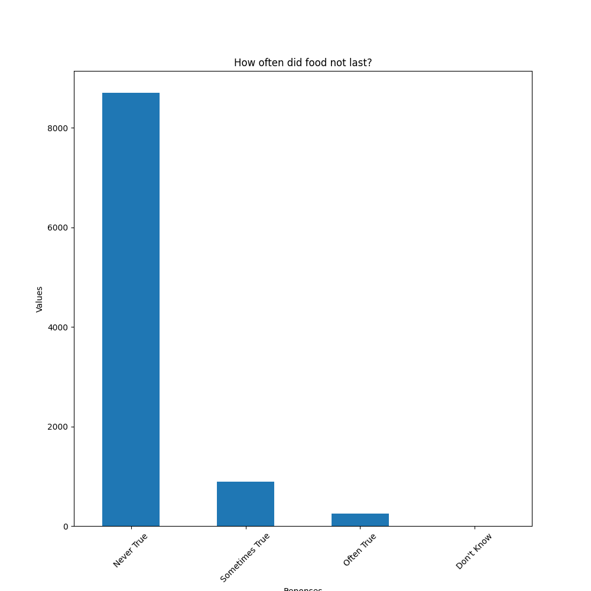

# Food Insecurity

This Jupyter Notebook contains a exploratory analysis of food insecurity via this link:

https://meps.ahrq.gov/mepsweb/data_stats/download_data_files_detail.jsp?cboPufNumber=HC-240

I downloaded the zip and then used the spreadsheet in the zip to begin my analysis. This is a still a work in progress.

## Update as of 20240831

As of this date I am currently doing data cleaning and generating basic diagrams that provide insight into the dataset. I choose this dataset because of the socioeconmic insights it offers in food security. I am still doing work on this dataset.

This diagram goes into details showcasing the details whether an individual went hungry.

In this diagram it showcases whether an individual food did not last.

## Acknowledgements

 - Professors at Kean University
 - Professors at NJIT
 - Research Mentors at Kean University
 - StackOverflow Q&A Discussion
 - ChatGPT
 - ClaudeAI

## Authors

- [@FPyC639](https://github.com/FPyC639)

## Appendix

